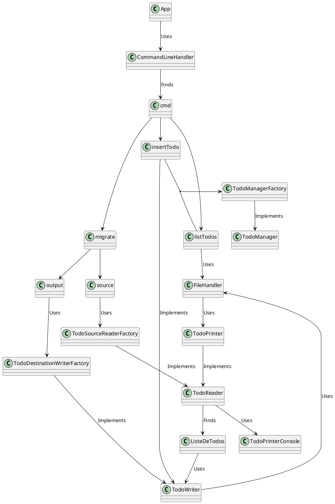

# L3 design pattern report

- **Firstname**: Alban
- **Lastname**: Stievenard

> Add your thoughts on every TP bellow, everything is interresting but no need to right a book.
> 
> Keep it short simple and efficient:
> 
> - What you did and why
> - What helped you and why
> - What did you find difficult
> - What did not help you
> - What did you need to change
> - Anything relevant
> 
> Add a link to schemas describing your architecture (UML or not but add a legend)
> 
> Remember: it is ok to make mistakes, you will have time to spot them later.
> 
> Fill free to contact me if needed.

---

## SCHEMA (fait avec PlantUML, la prévisu fonctionne sur IDEA mais pas github visiblement)

## TP1

Réalisation du Single Responsability Principle -> Création de nouvelles classes pour séparer les responsabilités.  

## TP2

Division du todo en 2 pour le single responsability car il gérait le json et le csv  

J'ai réussi le flag --done pour le json mais je me suis rendu compte en voulant faire le csv que c'était pas opti du tout.  
J'ai envoyé un mail sur la mauvaise adresse mail je crois pour avoir des infos mais je m'en suis rendu compte trop tard.  
Faudrait pouvoir faire en sorte de créer plus simplement les types de fichiers gérés par le programme.  

Création de TodoPrinter pour mieux gérer le list  
--done qui fonctionne correctement en terminal pour csv mais pas encore ghosttests  
Il faut faire en sorte que les managers soient des façades  

Reste à faire :   
gérer les virgules en csv  
répétition if dans l'App à mieux faire

Avant de faire la nouvelle commande migrate, optimisation du code déjà présent pour les SOLID  
Création de différents packages pour mieux organiser le code  

Affichage CSV fonctionnel  
GhostTests TP2 OK

Printer à dissocier en csv et json

## TP 3

ça fonctionne 128/128
maintenant il faut optimiser le code selon SOLID :
TodoPrinter à séparer
Commands à créer pour faire de la place dans l'App
